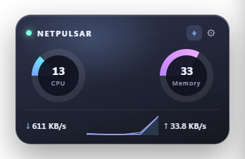
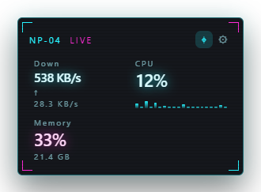
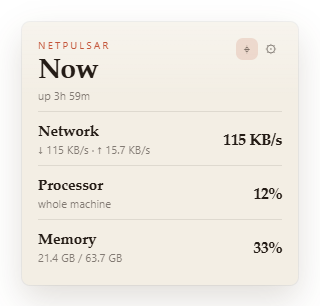
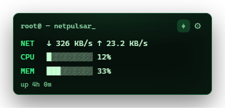
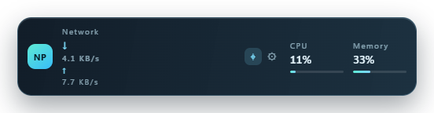
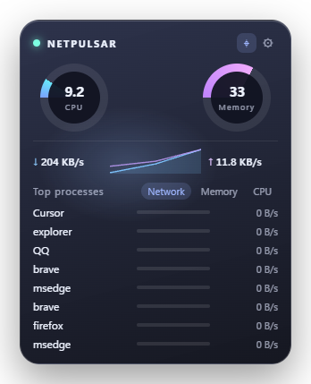

# NetPulsar

<p align="center">
  
</p>

NetPulsar is a small desktop widget for live CPU, memory, disk, and network use. Hover it to open a process ranking. Skins and languages live in folders next to the executable, so both can be extended without rebuilding.

On Windows the widget stays out of the taskbar and sits in the notification area. Right-click that icon for Settings and Close. Left-click brings the widget back. The same icon is embedded in the executable.

<p align="center">
  
  
  
  
  
  
</p>

## Build

Windows production build (required; without `-tags production` the window does not open):

```bash
go build -tags production -ldflags "-H windowsgui" -o NetPulsar.exe .
```

`--check` prints one metrics sample as JSON. `--reset` clears the saved position and turns edge-hide and auto-hide off.

## Settings

Saved at `%AppData%\NetPulsar\settings.json` on Windows (`~/Library/Application Support/NetPulsar` on macOS, `~/.config/NetPulsar` on Linux).

- Refresh interval, opacity, widget scale, window glow, always on top, computer name, smooth rings and sparklines
- Edge hide and auto hide, peek size, snap distance
- Module order, ranking order (CPU / memory / network), row count
- Click a process to open its folder or copy its name, PID, usage, and path
- Launch at login

Always on top stays above ordinary and maximized windows. A real fullscreen app (no title bar, covering the whole monitor) makes the widget step aside. While the widget is edge-hidden, auto-hidden, or covered by fullscreen, sampling pauses and resumes when it is visible again.

Edge hide only slides back out when the pointer reaches the exposed strip, including while another window is in front. Launching the program again also brings it back.

## Skins

`skins/<id>/` needs `skin.json`, `layout.html`, and `style.css`. Optional `main.js` runs after the layout loads.

Useful attributes:

| Attribute | Role |
| --- | --- |
| `data-field` | `cpu`, `mem`, `disk`, `down`, `up`, `host`, `uptime`, byte totals, disk read/write |
| `data-format` | `pct`, `rate`, `bytes`, `bar`, `uptime` |
| `data-module` | `cpu`, `mem`, `net`, `disk` — hidden and reordered from settings |
| `data-ring` / `data-bar` | percentage written to `--p` |
| `data-procs` | process list |
| `data-sort` | `cpu`, `mem`, or `net` |
| `data-drag` | drag handle |
| `data-i18n` | string key |
| `data-host` | computer name |

Bundled skins: aurora, neon, paper, terminus, tide. Existing files are not overwritten. “Restore this skin” copies the bundled files back.

## Languages

`locales/<id>.json`:

```json
{
  "name": "日本語",
  "strings": {
    "settings.title": "設定"
  }
}
```

The file name is the language id. Missing keys fall back to `zh-CN.json`. Add a file, refresh the list in settings, then select it.
